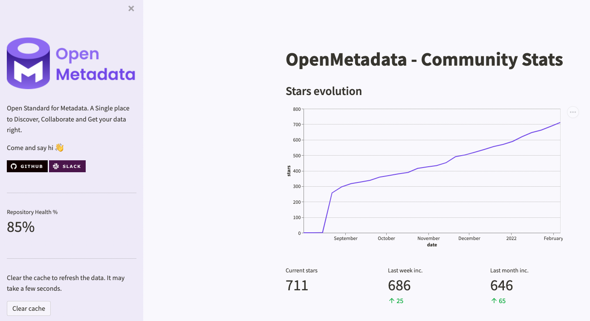

# Open Stats

<div align="center">

<p align="center">
    <em>Discover and share the KPIs of your OpenSource project.</em>
</p>

[](https://github.com/pmbrull/open-stats/releases)
[](LICENSE)

</div>

---

OpenStats is a library built on top of [streamlit](https://streamlit.io/) that extracts data from the Github API
and shows the main KPIs for an OpenSource project:
- **Star evolution**: What is the popularity of the repo?
- **Good First issues**: Is there a focus towards the community?
- **Recurrent collaborators**: How many people are involved?
- **Repository traffic**: How many visits and clones do we have?

While there many other things to take into account, these metrics help us get a taste on how our project is doing in
a single view.

> If you'd like to see other metrics or graphics, open an issue or jump into the action!

---

- [Requirements](#requirements)
- [How does it work?](#how-does-it-work)
- [Config](#config)
- [Secrets](#secrets)
- [Caching](#caching)
- [Publishing](#publishing)
- [Contributing](#contributing)
- [Acknowledgements](#acknowledgements)
- [License](#license)

## Requirements
- Python 3.6+
- The main dependencies are `streamlit` and `pandas`. The configuration is managed with [Levy](https://github.com/pmbrull/levy).
- In terms of permissions, the traffic data requires an account (token) with `write` to the repo.

You can install OpenStats with:

```commandline
$ pip install openstats
---> 100%
Successfully installed openstats
```

## How does it work?

OpenStats is a helper tool to build an amazing dashboard from a config file. You can check an example [here](https://github.com/pmbrull/OpenMetadata-stats):



To run a `streamlit` app, we need the following ingredients:

- `app.py` file that triggers the application.
- `requirements.txt`, where we will just add `openstats`
- Optionally, a `.streamlit/config.toml` config file with the theme.

By creating an `openstats.yaml` file, we will pick up the necessary information, build the streamlit components 
and help you generate the theme file 🚀

This means that the final setup can look like this:

- An `app.py` with:
  ```python
  from openstats.app import run

  if __name__ == "__main__":  
      run()
  ```
- A `requirements.txt` file with `openstats`.
- An `openstats.yaml` file following the examples 👇

### Theme

To generate the theme file based on the config, you can run `openstats-theme` after installing `openstats`.

This will create the `.streamlit/config.toml` file with the properties defined in our `openstats.yaml`.

## Config

Let's take a look at how to configure `openstats.yaml`. You can see an example [here](openstats.yaml):

```yaml
title: "Dashboard title"
logo_file: "Image file to show at the sidebar"

client:  # Information about the repository
  root: "api.github.com"  # We only support GitHub API
  owner: "e.g., pmbrull"
  repo: "e.g., OpenStats"
  start_date: "Start counting stars from this date"  # Format "Aug 1 2021" (`%b %d %Y`)

style:  # To generate the streamlit theme
  primary_color: "#7147E8"  # Also used for the charts coloring
  background_color: "#F9F8FD"
  secondary_background_color: "#EEEAF8"
  text_color: "#37352F"
  font: "sans serif"

social: "
        Free markdown text! Show your badges 💪
        "
```

Note that the `style` section is only to centralise and generate the `config.toml` file for `streamlit`. The
only added value here is that we will use the `primary_color` for the theme and charts.

If you don't want to add any image to the sidebar, just remove the YAML entry.

> More on streamlit themes 👉 [blog](https://blog.streamlit.io/introducing-theming/)

### Minimum Config

The app can run with as minimum configuration as:

```yaml
title: "Levy"

client:
  root: "api.github.com"  # We only support GitHub API
  owner: "pmbrull"
  repo: "levy"
  start_date: "Aug 1 2021"  # Format `%b %d %Y`
```

## Secrets

To show the traffic data and to have a higher API query rate, we need to identify ourselves to the GitHub API.

OpenStats only supports authenticated requests. To make things work, there are two options:

1. Prepare an `API_TOKEN` environment variable before running the app
2. Use [streamlit secrets](https://blog.streamlit.io/secrets-in-sharing-apps/) when publishing the app. The secret
    should also be named `API_TOKEN`.

The app will first try to obtain the token from the environment variables and will fall back to using streamlit secrets.

> How to create an access token 👉 [docs](https://docs.github.com/en/authentication/keeping-your-account-and-data-secure/creating-a-personal-access-token)

## Caching

Not all computations are lightning fast. In order to provide the best possible UX, we cache the API results using
`streamlit` memoization features. If you want to refresh the data, there is a `clear cache` button available.

## Publishing

You can create and manage your `streamlit` apps at https://share.streamlit.io/. You can follow the [docs](https://docs.streamlit.io/streamlit-cloud/get-started/deploy-an-app)
for more information.

## Contributing

Take a look at our [CONTRIBUTING](CONTRIBUTING.md) guide.

## Acknowledgements

Thanks to [streamlit](https://streamlit.io/) for an amazing library and the [GitHub API](https://docs.github.com/en/rest)
for sharing all the information! 

## License
OpenStats is released under [Apache License, Version 2.0](http://www.apache.org/licenses/LICENSE-2.0)
